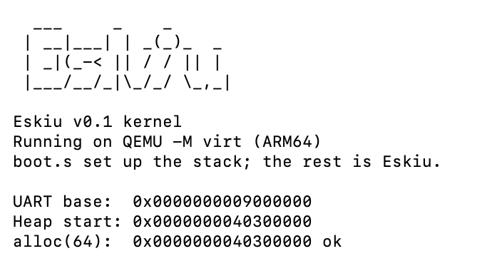

<p align="center">
  
</p>

<h2 align="center">eskiu</h2>
<p align="center">A self-hosting systems language with the power of C and the immediacy of a scripting language.</p>
<p align="center">
  <a href="https://eskiu-lang.org">eskiu-lang.org</a> &nbsp;&middot;&nbsp;
  <a href="docs/lang/getting-started.md">Documentation</a> &nbsp;&middot;&nbsp;
  <a href="QUICKSTART.md">Quickstart</a> &nbsp;&middot;&nbsp;
  <a href="CHANGELOG.md">Changelog</a>
</p>

<p align="center">
  <a href="https://github.com/doranteseduardo/eskiu/actions/workflows/ci.yml"></a>
  <a href="CHANGELOG.md"></a>
  
  <a href="LICENSE"></a>
</p>

---

Eskiu compiles to native code through LLVM, with explicit memory, direct C interop, and no garbage collector. Yet `eskiuc run file.esk` and a `#!/usr/bin/env eskiuc run` shebang execute a `.esk` file directly, like a Python or Ruby script. The same language reaches from a bare-metal ARM64 kernel to an HTTP/2 server with TLS, in C-style syntax with bounded generics, structural interfaces, sum types with `match`, operator overloading, `async`/`await`, and opt-in memory safety (`defer`, slices, checked nullable pointers). It builds and runs on Linux, macOS, and Windows.

The compiler is **self-hosted**: the whole pipeline (lexer, preprocessor, parser, type checker, and code generator) is written in Eskiu itself (`selfhost/`) and reproduces its own output through a 3-stage bootstrap fixpoint, with its code generator feature-complete against the reference C++ compiler.

Eskiu already runs in shipping software: [ReactVision](https://eskiu-lang.org/case-study-reactvision.html) migrated AR/VR rendering modules from C++ for roughly 85% less memory, and a [Nintendo 3DS](https://eskiu-lang.org/case-study-3ds.html) runs an on-device AR demo with its logic in Eskiu on the ARM11.

<p align="center">
  
</p>

## Install

On macOS or Linux, install the latest release with one command:

```bash
curl -fsSL https://eskiu-lang.org/install.sh | sh
```

It downloads the prebuilt binary for your platform, verifies its checksum, and installs it.
Prebuilt binaries (macOS arm64, Linux x86-64, Windows x86-64) are on the
[releases page](https://github.com/doranteseduardo/eskiu/releases). Or build from source:

```bash
git clone https://github.com/doranteseduardo/eskiu && cd eskiu
cmake -S . -B build && cmake --build build
./build/eskiuc examples/hello.esk -o hello && ./hello
```

## Example

```eskiu
extern int printf(string fmt, ...);

interface Drawable { void draw(); }

struct Circle {
    float radius;
    void draw() { printf("Circle(r=%f)\n", self.radius); }
}

void render(Drawable d) { d.draw(); }

int apply(fn(int)->int f, int x) { return f(x); }

int main() {
    let c: Circle = Circle { radius: 5.0 };
    render(&c);                                     // Circle(r=5.000000)

    let square: fn(int)->int = int(int n) { return n * n; };
    printf("%d\n", apply(square, 6));               // 36

    return 0;
}
```

## Building from source

Installing a release needs no toolchain, but building the compiler does:

- LLVM 17+ (tested with LLVM 22)
- C++17 compiler
- CMake 3.20+
- A C toolchain (`cc`/`clang`/`gcc`): `eskiuc` invokes it to link executables (not needed for `--freestanding`). This one is a runtime requirement too, since compiling any program links through it.

## Documentation

| | |
|---|---|
| [QUICKSTART.md](QUICKSTART.md) | Build and run your first program in 5 minutes |
| [docs/lang/getting-started.md](docs/lang/getting-started.md) | Language tutorial |
| [docs/lang/spec.md](docs/lang/spec.md) | Full language reference |
| [docs/dev/phases.md](docs/dev/phases.md) | Feature status and roadmap |

## Licence

MIT. See [LICENSE](LICENSE)
