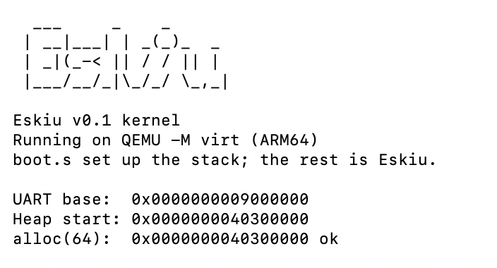

<p align="center">
  
</p>

<h2 align="center">eskiu</h2>
<p align="center">A self-hosting systems language with the power of C and the immediacy of a scripting language.</p>
<p align="center"><sub>Part of the <a href="https://reactvision.xyz">ReactVision</a> family</sub></p>
<p align="center">
  <a href="https://eskiu-lang.org">eskiu-lang.org</a> &nbsp;&middot;&nbsp;
  <a href="docs/lang/getting-started.md">Documentation</a> &nbsp;&middot;&nbsp;
  <a href="QUICKSTART.md">Quickstart</a> &nbsp;&middot;&nbsp;
  <a href="CHANGELOG.md">Changelog</a>
</p>

<p align="center">
  <a href="https://github.com/doranteseduardo/eskiu/actions/workflows/ci.yml"></a>
  <a href="CHANGELOG.md"></a>
  
  <a href="LICENSE"></a>
</p>

---

Eskiu is a systems language with C's control over memory and calling conventions, and a
quicker feel for everyday work. It compiles to native code through LLVM and calls C
libraries directly, and `eskiuc run file.esk` (or a `#!/usr/bin/env eskiuc run` shebang)
runs a source file the way you would run a Python or Ruby script.

- **C-style and C-compatible.** C syntax and integer rules, structs, unions, bitfields and
  `extern` declarations laid out and called the way the target's C compiler does it.
- **More than C.** Generics, structural interfaces, sum types with exhaustive `match`,
  closures, operator overloading and `async`/`await`.
- **Explicit memory with guard rails.** No garbage collector: `alloc`/`free`, allocators,
  `defer`, slices, checked nullable pointers and an opt-in bounds-checked build (`--safe`).
- **A batteries-included stdlib.** Collections, strings, JSON, regex, an async runtime and
  HTTP/1.1, HTTP/2 and TLS servers.
- **Self-hosted.** The compiler is also written in Eskiu (`selfhost/`) and builds itself.

It runs on macOS, Linux and Windows, cross-compiles to 32-bit ARM and x86, and runs bare
metal: the screenshot below is an Eskiu kernel booting in QEMU with no libc.

<p align="center">
  
</p>

## Example

```eskiu
import <mem>;
extern int printf(string fmt, ...);

enum Shape {
    Circle(float),
    Rect(float, float)
}

float area(Shape s) {
    match s {
        Circle(r)  -> { return 3.14159 * r * r; }
        Rect(w, h) -> { return w * h; }
    }
    return 0.0;
}

int apply(fn(int)->int f, int x) { return f(x); }

int main() {
    *Shape shapes = alloc<Shape>(2);
    defer free(shapes);                          // runs on every exit path
    shapes[0] = Circle(1.0);
    shapes[1] = Rect(2.0, 3.0);
    for (i in 0..2) {
        printf("area %d = %.2f\n", i, area(shapes[i]));
    }

    int k = 10;
    printf("%d\n", apply(int(int x) { return x + k; }, 5));   // closure capturing k
    return 0;
}
```

```
$ eskiuc run shapes.esk
area 0 = 3.14
area 1 = 6.00
15
```

## Status

Eskiu is pre-1.0. The language is stable enough for real work, and it is used at
[ReactVision](https://reactvision.xyz): the [ViroReact](https://eskiu-lang.org/case-study-reactvision.html)
renderer moved AR/VR rendering modules from C++ to Eskiu for about 85% less memory, and a
[Nintendo 3DS](https://eskiu-lang.org/case-study-3ds.html) runs an on-device AR demo with its
logic in Eskiu. Until 1.0, a minor release can still reject code an earlier one accepted
when that code relied on a bug; each release's notes list those changes. Next on the
[roadmap](docs/dev/phases.md) is a package manager.

## Install

On macOS or Linux:

```bash
curl -fsSL https://eskiu-lang.org/install.sh | sh
eskiuc --version
```

The script picks the prebuilt binary for your platform (macOS arm64, Linux x86-64 or arm64),
verifies its checksum and installs it. The Windows x86-64 build and the tarballs are on the
[releases page](https://github.com/doranteseduardo/eskiu/releases). `eskiuc` links programs
with your system C toolchain (`cc`, `clang` or `gcc`), so have one installed.

To build from source you need LLVM 21 or newer (22 recommended), CMake 3.20+ and a C++17
compiler:

```bash
git clone https://github.com/doranteseduardo/eskiu && cd eskiu
cmake -S . -B build && cmake --build build
./build/eskiuc examples/hello.esk -o hello && ./hello
```

## Documentation

| | |
|---|---|
| [Quickstart](QUICKSTART.md) | Install and run your first programs |
| [Tutorial](docs/lang/getting-started.md) | The language, step by step |
| [The Book of Eskiu](https://eskiu-lang.org/the-book-of-eskiu.html) | A longer guide, from basics to async and C interop |
| [Language reference](docs/lang/spec.md) | Every construct and the standard library |
| [Examples](examples/) | Small programs, from hello world to an HTTP/2 server |
| [Compiler internals](docs/dev/index.md) | Architecture, ABI notes and design decisions |
| [Changelog](CHANGELOG.md) | Every release and what changed |

## Contributing

Bug reports are welcome; please include the program and the `eskiuc --version` output.
Open an issue before working on a new language feature or a design change. Scoped fixes can
go straight to a pull request. [docs/dev/contributing.md](docs/dev/contributing.md) covers
the build, the test suite and the two compilers that every language change has to keep in
step.

## License

MIT. See [LICENSE](LICENSE). A [ReactVision](https://reactvision.xyz) project.
